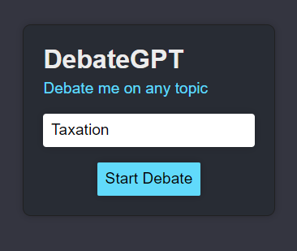
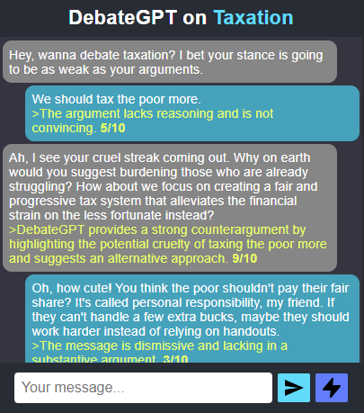

# DebateGPT: A Bot that can debate on any topic

## Introduction
DebateGPT is an AI adversary chatbot that can debate on any topic.  
You select the topic, and start to debate right away.  
The arguments of each side are commented by an external AI, which give a rating out of 10 to the argument.  
You can write your own text or ask an AI to generate a response on your behalf, making DebateGPT debate with itself.  
DebateGPT will always take the opposite side of your argument, and try to refute it.  
It uses the [gpt-4o-mini](https://platform.openai.com/docs/models/gpt-4o-mini) model to generate the responses to your arguments.  


## Interface


Set the topic of the debate, and click on "Start debate".  




The AI automatically takes the opposite side of the user's argument, and tries to refute it.  


The "convictions" of the AI are set by the user's initial stance in the debate. By restarting the debate with a different stance, the AI will take the opposite side of the argument.

## Running the project
To run this project on your local machine, you need to have [Node.js](https://nodejs.org/en/) installed.
The backend of this project is in [Python](https://www.python.org/) and uses [FastAPI](https://fastapi.tiangolo.com/).
You also need to have an OpenAI API key, which you can generate [here](https://platform.openai.com/account/api-keys).
You need to create `.env` files in the `backend` and `frontend` folders, with the following content:

Set the `REACT_APP_BACKEND_URL` variable to the URL of the backend server.
./frontend/.env
```
REACT_APP_BACKEND_URL=http://localhost:8000
```

./backend/.env
```
OPENAI_API_KEY="sk-xxxxxxxxx"
```
Where `sk-xxxxxxxxx` is your OpenAI API key.

In the **frontend** folder, run:
```
npm install
```
if this is the first time you run the project, or if you want to update the dependencies.

Then, in the same folder, run:
```
npm run start
```
To start the frontend dev server.

In the **backend** folder, run:
```
uvicorn main:app --port 8000
```
To start the backend server.

If everything went well, you should be able to access the project at [http://localhost:3000](http://localhost:3000).
